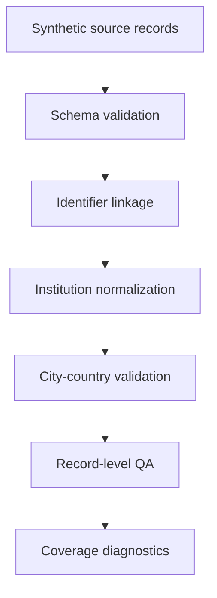

# Author-Institution Linkage and Geocoding Feasibility Audit

A reproducible synthetic demonstration and measurement audit framework for author-institution-city linkage.

This repository is a **public demonstration**. It is separate from the author's **private research workflow**, which may use restricted bibliographic data, private audit logs, and non-public validation materials. Restricted source data are not redistributed here. Future optional source adapters for Scopus, OpenAlex, ROR, or other services would require separate license, credential, and ethics review.

## Project overview

The repository demonstrates how publication-level author-institution records can be checked, linked, geocoded, and audited before they are used in research on scientific geography or mobility. It is designed as a transparent measurement scaffold rather than a full-scale data collector.

## Why linkage measurement matters

Author-affiliation data are common in bibliographic databases, but their meaning is limited. A paper-level affiliation city is not automatically equivalent to a focal scientist's employment city, and an author-institution linkage is not automatically a verified career-mobility event. The workflow therefore separates identifier linkage, institution-city attribution, record-level QA, and coverage diagnostics.

## Public and private workflow boundary

Public demonstration:

- synthetic source records;
- local schema validation;
- deterministic institution alias normalization;
- identifier-based linkage;
- city-country validation;
- record-level QA;
- reproducible example outputs.

Private or future optional workflow:

- licensed Scopus or Elsevier data access;
- real OpenAlex/ROR source adapters;
- credential management;
- scientist-level validation;
- large-scale API collection;
- non-public drafts or project-specific results.

## What the repository demonstrates

- Config-driven synthetic pipeline execution.
- Schema validation using JSON files under `data/expected_schema/` as the authoritative schema source.
- Handling of missing author, work, and institution identifiers.
- Distinguishing linkage validity from geocoding completeness.
- Low-confidence, duplicate, multi-affiliation, and source-conflict flags.
- Same-name city disambiguation by city-country key.
- Fixed expected outputs for review and tests.

## What it does not demonstrate

- It does not perform live Scopus, OpenAlex, ROR, or other API collection.
- It does not include real scientists, papers, institutions, or career histories.
- It does not redistribute restricted source data.
- It does not infer employment or career mobility from paper affiliations.
- It does not claim large-scale empirical coverage or research findings.

## Synthetic data design

All sample records in `data/synthetic_sample/` are fictional. They cover exact matches, missing identifiers, nonexistent works and institutions, missing city/country fields, invalid coordinates, low confidence, duplicates, multi-institution authorship, same-name cities in different countries, and source agreement/conflict cases.

## Data model

Core synthetic inputs:

- `author_work_institution.csv`
- `works.csv`
- `institutions.csv`
- `institution_aliases.csv`
- `source_comparison.csv`

The alias example demonstrates deterministic normalization only and is not a substitute for validated entity resolution.

## Configuration

The pipeline reads JSON configuration:

```bash
python scripts/run_example_pipeline.py --config config/config.example.json
```

Configuration controls input/output directories, minimum confidence threshold, duplicate handling, and coordinate validity requirements.

## Installation

Python 3.10 or later is recommended.

```bash
python -m pip install -r requirements.txt
```

The runtime pipeline uses the Python standard library. `pytest` is used for tests.

## Quick start

```bash
python scripts/run_smoke_test.py
python scripts/run_example_pipeline.py --config config/config.example.json
python -m pytest -q
```

## Example outputs

Fixed synthetic review outputs are stored in `examples/expected_outputs/`. Runtime outputs are written to `outputs/example_outputs/`, which is ignored by Git.

Expected output files:

- `linked_author_institution_city.csv`
- `record_level_audit.csv`
- `coverage_summary.csv`
- `source_comparison_summary.csv`

## Quality-control logic

The pipeline records:

- `linkage_valid`
- `geocoding_valid`
- `duplicate_flag`
- `source_conflict_flag`
- `multi_affiliation_flag`
- `qa_status`
- `qa_notes`

This distinguishes linkage success with incomplete geocoding from linkage failure, low-confidence records, duplicate records, and source conflicts.

## Workflow



## Measurement boundaries

See `docs/measurement_boundaries.md`. The central boundary is that publication affiliation metadata provide evidence about paper-level institutional addresses, not direct proof of verified employment or career moves.

## Limitations

This is a reproducible synthetic demonstration. It is not a production entity-resolution system, does not run fuzzy matching, and does not validate real author identities. Results from this repository should not be interpreted as empirical findings about real scientists, institutions, or mobility events.

## Reproducibility scope

The included scripts reproduce the synthetic example only. They do not access external APIs and do not require credentials.

## Repository structure

```text
config/                 JSON configuration example
data/                   synthetic sample and authoritative schema JSON
examples/expected_outputs/ fixed synthetic expected outputs
src/                    public-candidate Python modules
scripts/                runnable smoke test and example pipeline
tests/                  pytest tests
docs/                   measurement and reproducibility notes
audit/                  release-review logs and source mappings
outputs/example_outputs/ runtime outputs ignored by Git
```

## Author contribution

Ran Wang developed the research design, measurement framework, and original feasibility-audit workflow. The public repository was restructured with AI-assisted coding and documentation and subsequently reviewed and validated by the author.

AI assistance does not replace the author's responsibility for code correctness, research claims, licensing, or public-release decisions. Ran Wang retains responsibility for the released repository and has confirmed that the included project logic and materials are not copied from an advisor, collaborator, or third-party codebase.

## License

The source code, documentation, schemas, and fully synthetic example materials in this repository are released under the MIT License. See `LICENSE`. Restricted bibliographic data, API responses, raw scientist records, and commercial database exports are not included and are not licensed by this repository.

## Citation

If you use this software, please cite it using the metadata provided in `CITATION.cff`.

## Release status

Version 0.1.0 is the initial public release of this synthetic demonstration and measurement-audit framework.
